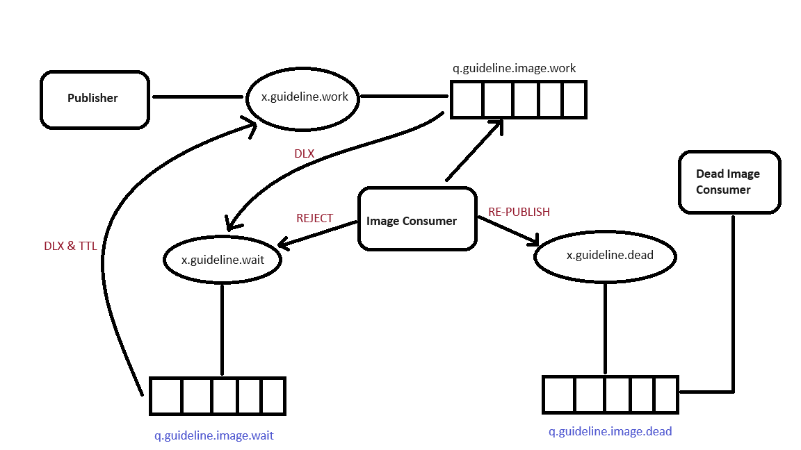

## Getting started with RabbitMQ

Producer → message bus → Consumer

Producer handover the message to exchange.
Exchanges uses routing key to decide which queue message it need to put the message.

Queue: a buffer that store messages

Exchange: routing message to queue > delivery officer
Distribute the message tp the queues
Copy the message if required (based on routing key)

Routing key: a key that the exchange looks at to decide how to route the message to queue

(The exchange will determine the queue to which it should deliver the message based on the routing key)

Binding: link(correlation ) between exchange and the queue

Exchanges, connections, and queues can be configured with parameters such as durable, temporary, and auto delete upon creation. 
Durable exchanges survive server restarts and last until they are explicitly deleted. Temporary exchanges exist until RabbitMQ is shut down. 
Auto-deleted exchanges are removed once the last bound object is unbound from the exchange.

Standard RabbitMQ message flow
The producer publishes a message to the exchange.
The exchange receives the message and is now responsible for the routing of the message.
Binding must be set up between the queue and the exchange. In this case, we have bindings to two different queues from the exchange. The exchange routes the message into the queues.
The messages stay in the queue until they are handled by a consumer.
The consumer handles the message.

#### Creating a simple producer
```
@Service
public class FixedRateProducer {

    @Autowired
    private RabbitTemplate rabbitTemplate;

    private int i = 0;

    @Scheduled(fixedRate = 500)
    public void sendMessage() {
        i++;
        rabbitTemplate.convertAndSend("course.fixedrate", "Fixed rate" + i);
    }
}
```

#### Creating a simple consumer
```
@Service
@Slf4j
public class FixedRateConsumer {

    @RabbitListener(queues = "course.fixedrate")
    public void listen(String message) {
        log.info("Consuming {}", message);
    }
}
```

### Using multiple consumers for each queue
Why we need it?
1. Producer/Publisher works faster than consumer
2. Consumer/Subscriber bottleneck

Create concurrent consumers with Spring boot
```
public class FixedRateConsumer {

    @RabbitListener(queues = "course.fixedrate", concurrency = "3-7")
    public void listen(String message) throws InterruptedException {
        TimeUnit.MILLISECONDS.sleep(ThreadLocalRandom.current().nextLong(1000, 2000));
        log.info("Consuming {} ", message);
    }
}
```

Use JSON format to pass message between producer to consumer
1. Easy and flexible
2. Dynamic nature

### RabbitMQ Exchanges
It has 4 different exchange types
1. Direct exchange - Send to selective queues, Message pass to the queue based on the routing key

```
If the routing key not matched with any queue then the message will be discarded
A direct exchange delivers messages to queues based on a message routing key. The routing key is a message attribute added to the message header by the producer. Think of the routing key as an "address" that the exchange is using to decide how to route the message. A message goes to the queue(s) with the binding key that exactly matches the routing key of the message.
The direct exchange type is useful to distinguish messages published to the same exchange using a simple string identifier.
The default exchange AMQP brokers must provide for the direct exchange is "amq.direct".
Imagine that queue A (create_pdf_queue) in the image below (Direct Exchange Figure) is bound to a direct exchange (pdf_events) with the binding key pdf_create. When a new message with routing key pdf_create arrives at the direct exchange, the exchange routes it to the queue where the binding_key = routing_key, in the case to queue A (create_pdf_queue).

SCENARIO 1
Exchange: pdf_events
Queue A: create_pdf_queue
Binding key between exchange (pdf_events) and Queue A (create_pdf_queue): pdf_create

SCENARIO 2
Exchange: pdf_events
Queue B: pdf_log_queue
Binding key between exchange (pdf_events) and Queue B (pdf_log_queue): pdf_log

EXAMPLE
Example: A message with routing key pdf_log is sent to the exchange pdf_events. The messages is routed to pdf_log_queue because the routing key (pdf_log) matches the binding key (pdf_log).

If the message routing key does not match any binding key, the message is discarded.
```
##### Default Exchange

The default exchange is a pre-declared direct exchange with no name, usually referred by an empty string. 
When you use default exchange, your message is delivered to the queue with a name equal to the routing key of the message. 
Every queue is automatically bound to the default exchange with a routing key which is the same as the queue name.

2. FanOut exchange (pub/sub)
Pass a single message to multiple queues
Broadcast to all queues bound to it
The routing key has no effect, if this exchange type is configured
Because a fanout exchange delivers a copy of a message to every queue bound to it, its use cases are quite similar:

```
Use cases
Massively multi-player online (MMO) games can use it for leaderboard updates or other global events
Sport news sites can use fanout exchanges for distributing score updates to mobile clients in near real-time
Distributed systems can broadcast various state and configuration updates
Group chats can distribute messages between participants using a fanout exchange (although AMQP does not have a built-in concept of presence, so XMPP may be a better choice)
```

3. Topic exchange

Add multiple criteria in the routing key to send message the queue

```
Topic exchanges route messages to queues based on wildcard matches between the routing key and the routing pattern, which is specified by the queue binding. Messages are routed to one or many queues based on a matching between a message routing key and this pattern.
The routing key must be a list of words, delimited by a period (.). Examples are agreements.us and agreements.eu.stockholm which in this case identifies agreements that are set up for a company with offices in lots of different locations. The routing patterns may contain an asterisk (“*”) to match a word in a specific position of the routing key (e.g., a routing pattern of "agreements.*.*.b.*" only match routing keys where the first word is "agreements" and the fourth word is "b"). A pound symbol (“#”) indicates a match of zero or more words (e.g., a routing pattern of "agreements.eu.berlin.#" matches any routing keys beginning with "agreements.eu.berlin").
The consumers indicate which topics they are interested in (like subscribing to a feed for an individual tag). The consumer creates a queue and sets up a binding with a given routing pattern to the exchange. All messages with a routing key that match the routing pattern are routed to the queue and stay there until the consumer consumes the message.
The default exchange AMQP brokers must provide for the topic exchange is "amq.topic".
```

```
SCENARIO 1
The image to the right shows an example where consumer A is interested in all the agreements in Berlin.

Exchange: agreements
Queue A: berlin_agreements
Routing pattern between exchange (agreements) and Queue A (berlin_agreements): agreements.eu.berlin.#
Example of message routing key that matches: agreements.eu.berlin and agreements.eu.berlin.headstore

SCENARIO 2
Consumer B is interested in all the agreements.

Exchange: agreements
Queue B: all_agreements
Routing pattern between exchange (agreements) and Queue B (all_agreements): agreements.#
Example of message routing key that matches: agreements.eu.berlin and agreements.us
rabbitmq topic exchange
Topic Exchange: Messages are routed to one or many queues based on a match between a message routing key and the routing pattern.

SCENARIO 3
Consumer C is interested in all agreements for European head stores.

Exchange: agreements
Queue C: headstore_agreements
Routing pattern between exchange (agreements) and Queue C (headstore_agreements): agreements.eu.*.headstore
Example of message routing keys that will match: agreements.eu.berlin.headstore and agreements.eu.stockholm.headstore

EXAMPLE
A message with routing key agreements.eu.berlin is sent to the exchange agreements. 
The messages are routed to the queue berlin_agreements because the routing pattern of "agreements.eu.berlin.#" matches the routing keys beginning with "agreements.eu.berlin". 
The message is also routed to the queue all_agreements because the routing key (agreements.eu.berlin) matches the routing pattern (agreements.#).
```
4. Headers Exchange
Multiple criteria at message header
Publish message with custom header
Special header x-match
    "all"(default): boolean AND
    "any": boolean OR

```
Example:
Christmas Promotion
Criteria: color, material
Promotion: discount, free delivery
Details
    white AND wood: discount
    red AND steel: discount
    red OR wood: free-delivery
```

```
A headers exchange routes messages based on arguments containing headers and optional values. Headers exchanges are very similar to topic exchanges, but route messages based on header values instead of routing keys.
A message matches if the value of the header equals the value specified upon binding.
A special argument named "x-match", added in the binding between exchange and queue, specifies if all headers must match or just one. 
Either any common header between the message and the binding count as a match, or all the headers referenced in the binding need to be present in the message for it to match. 
The "x-match" property can have two different values: "any" or "all", where "all" is the default value. A value of "all" means all header pairs (key, value) must match, while value of "any" means at least one of the header pairs must match. 
Headers can be constructed using a wider range of data types, integer or hash for example, instead of a string. The headers exchange type (used with the binding argument "any") is useful for directing messages which contain a subset of known (unordered) criteria.

The default exchange AMQP brokers must provide for the topic exchange is "amq.headers".


EXAMPLE
Exchange: Binding to Queue A with arguments (key = value): format = pdf, type = report, x-match = all
Exchange: Binding to Queue B with arguments (key = value): format = pdf, type = log, x-match = any
Exchange: Binding to Queue C with arguments (key = value): format = zip, type = report, x-match = all

SCENARIO 1
Message 1 is published to the exchange with header arguments (key = value): "format = pdf", "type = report".
Message 1 is delivered to Queue A because all key/value pairs match, and Queue B since "format = pdf" is a match (binding rule set to "x-match =any").

SCENARIO 2
Message 2 is published to the exchange with header arguments of (key = value): "format = pdf".
Message 2 is only delivered to Queue B. Because the binding of Queue A requires both "format = pdf" and "type = report" while Queue B is configured to match any key-value pair (x-match = any) as long as either "format = pdf" or "type = log" is present.

rabbitmq Headers exchange
Example of Headers Exchange. Routes messages to queues that are bound using arguments (key and value) in the amq.headers attribute.

SCENARIO 3
Message 3 is published to the exchange with header arguments of (key = value): "format = zip", "type = log".
Message 3 is delivered to Queue B since its binding indicates that it accepts messages with the key-value pair "type = log", it doesn't mind that "format = zip" since "x-match = any".
Queue C doesn't receive any of the messages since its binding is configured to match all of the headers ("x-match = all") with "format = zip", "type = pdf". No message in this example lives up to these criterias.
It's worth noting that in a header exchange, the actual order of the key-value pairs in the message is irrelevant.
```

### Configure RabbitMQ with REST API
1. Manual setting is slow & error-prone
2. Using Rest API provided by RabbitMQ
3. Postman collection for easier setup

### Dead Letter Exchange(DLX)

Exception might happen
Spring by default will requeue message
Infinite consumer loop
Send problematic message to DLX with requeue = false
Other consumer can process the DLX queue with proper error handling
DLX is not exchange
Also works for timeout (If a message stay too long in the queue, it will move to dead letter queue (timeout configured))

Time To Live (timeout)
After TTL, message is dead
Queue can be configured to send "dead" message to DLX(by default in spring if a listener throws an exception then the message will be re-queued)
Various cases usage

Add following flags as argument when create the queue
Features
x-dead-letter-exchange:	x.picture.dlx
x-dead-letter-routing-key -> optional only used when there is an exchange type found with direct, topic

Ways to move the message to DLX
Solution 0:
    TTL(timeout) - when no consumer found

Add following flags as argument when create the queue
x-message-ttl : 5000

Solution 1:
Spring provides special exception class to automatically reject message which is AmqpRejectAndDontRequeueException
(throw the exception -  throw new AmqpRejectAndDontRequeueException("Picture size too large: " + picture); )

Solution 2:
We can do manual rejection if there is an error, Instead of throw the exception.

Add below property in the application.properties file
spring.rabbitmq.listener.simple.acknowledge-mode = manual

A amqp_deliveryTag is a unique identifier for each message 

Which solution to choose?
Throwing exception provides us low level risk
Manual rejection has a caveat, that is all consumer in the project needs to be manually marked with ack or reject
If someone forget about this then, the message will be processed repeatedly.

Retry mechanism

Either keep requeue, or send to DLX
Need something in between
Retry after x seconds, for N times
After more than N, send to DLX

Retry Mechanism - For Direct Exchange



**Consumer with retry**
1. Check the retry limit
2. If retry limit < threshold, send message to wait exchange
3. If retry limit reached, send message to dead exchange

Header
X-Death has a retry count

Retry Mechanism - For Fanout Exchange
**Consumer with retry**
1. Check the retry limit
2. If retry limit < threshold, send message to wait exchange(direct exchange). Use correct routing key
Because, one queue might be processed and the other queue don't process the message(so only one queue need to process the message) 
3. If retry limit reached, send message to dead exchange

**Example**
Exchanges
    x.guideline2.xxx
Queues
    q.guideline2.accounting.xxx
    q.guideline2.marketing.xxx


### Spring boot retry mechanism (x.spring.__ , q.spring.__)
No code
Configure on application.yml
Define interval for retry
Define maximum retry attempts
Retry interval multiplier

No wait exchange
Once consumer class, two methods

```
# Spring retry mechanism - settings
spring.rabbitmq.listener.simple.acknowledge-mode = auto
spring.rabbitmq.listener.simple.retry.enabled=true
spring.rabbitmq.listener.simple.retry.initial-interval=3s
spring.rabbitmq.listener.simple.retry.max-interval=10s
spring.rabbitmq.listener.simple.retry.max-attempts=5
spring.rabbitmq.listener.simple.retry.multiplier=2
```

### Auto JSON Conversion

```
spring config

@Bean
public ObjectMapper objectMapper() {
   return JsonMapper.builder().findAndAddModules().build();
}

@Bean
public Jackson2JsonMessageConverter converter(ObjectMapper objectMapper) {
    return new Jackson2JsonMessageConverter(objectMapper);
}
```

### Spring Impl
```
public void sendMessage(DummyMessage data) throws JsonProcessingException {
   template.convertAndSend("x.dummy", "", data);
}
```

### Enable/Disable all the spring listeners
A common interface defining methods for start/stop lifecycle control. The typical use case for this is to control asynchronous processing. NOTE: This interface does not imply specific auto-startup semantics. Consider implementing SmartLifecycle for that purpose.

```
@Service
@Slf4j
public class RabbitMQScheduler {

    @Autowired
    private RabbitListenerEndpointRegistry registry;

    @Scheduled(cron = "0 0 23 * * *")
    public void stopAll() {
        registry.getListenerContainers().forEach(c -> {
            log.info("Stopping listener container {}", c);
            c.stop();
        });
    }

    @Scheduled(cron = "1 0 0 * * *")
    public void startAll() {
        registry.getListenerContainers().forEach(c -> {
            log.info("Stopping listener container {}", c);
            c.stop();
        });
    }
}
```

Channel Prefetch count

Default count per consumer is 250

```
nowing how to tune your broker correctly brings the system up to speed without
having to set up a larger cluster or doing a lot of updates in your client code. Understanding how to optimize the RabbitMQ prefetch count maximizes the speed of the
system.

The RabbitMQ prefetch value is used to specify how many messages are being sent at
the same time.

Messages in RabbitMQ are pushed from the broker to the consumers. The RabbitMQ
default prefetch setting gives clients an unlimited buffer, meaning that RabbitMQ, by
default, sends as many messages as it can to any consumer that appears ready to accept
them. It is, therefore, possible to have more than one message "in flight" on a channel at
any given moment.
```
### Change the prefetch setting

The number of messages sent to the consumer at the same time can be specified through the prefetch count value. The prefetch count value is used to get as much out of the consumers as possible.
If the prefetch count is too small, it could negatively affect the performance of RabbitMQ, since the platform is usually waiting for permission to send more messages.

The number of allowed unacknowledged messages in consumer side is called as prefetch count.
All Prefetch messages are removed from the rabbitmq and assign to consumer memory (channel).
spring default prefetch count is  250

spring.rabbitmq.listener.simple.prefetch=1

```
Example
                        Producers
                             |  produces
                       500 messages
                             |   
    -------------------------------------------------
    | Message processing     |                      |        
    | takes long time        |                      |
  consumer 1            consumer 2              consumer 3
  250 messages         250 messages                Idle (because allow the messages are allocated to consumer 1 & 2)
```

### Estimate Prefetch value count
```
|---------------------------------------------------------------------|
|consumer for each queue | Process time each message | prefetch value |
|---------------------------------------------------------------------|
|One or few              | Fast                      | High           |   
|---------------------------------------------------------------------|
|Many                    | Fast                      | Medium         |
|---------------------------------------------------------------------|
|One or few              |                           |                |   
|------------------------| Slow                      | 1(One)         |
|Many                    |                           |                |   
|---------------------------------------------------------------------|

Prefetch value depends on the computing power and the number of consumers
```

### multiple prefetch values

```
Create multiple beans with different prefetch count, like below

    @Bean
    public RabbitListenerContainerFactory<SimpleMessageListenerContainer> prefetchOneContainerFactory(
            SimpleRabbitListenerContainerFactoryConfigurer configurer,
            ConnectionFactory connectionFactory) {
        var factory = new SimpleRabbitListenerContainerFactory();
        configurer.configure(factory, connectionFactory);
        factory.setPrefetchCount(1);
        return factory;
    }
    
configure the consumer,    
    
    @RabbitListener(queues = "q.dummy", containerFactory = "prefetchOneContainerFactory")
    public void listenDummy(DummyMessage message) {
        log.info("Message is {}", message);
    }

```

### Message Order

Publisher --> E|D|C|B|A --> Consumer
RabbitMQ rule is : If we have only one consumer that listens to that one queue,
Order of processing is guaranteed (Consumer receives A|B|C|D|E)

If we have multiple consumers then the order is not guaranteed due to the competition.
```
Impact

Message: invoice-created, invoice updated, invoice-paid
expected result: Invoice status is PAID
Competing consumer: CREATED-PAID-UPDATED
Possible actual result: invoice status is UPDATED

```

### Multiple Message types

#### One Queue for One Message Type

```
           |------q.invoice.paid-------- {inv_number:'', paid_date:'', payment_number=''
           | Routing key: paid
x.invoice -|
           | Routing key: created
           |-----q.invoice.created------ {inv_number:'', created_date:'', amount='', currency=''} 
```

#### One Queue for Multiple Message Types

```         
x.invoice ------> q.invoice | | | |2|1|
                                   | |
      -----------------------------| |
      |                              |
 |-----------------------|     |-----------------------|
 |TypeID: invoice.created|     |TypeID: invoice.paid   | 
 |-----------------------|     |-----------------------|
 |{                      |     |{                      |
 |   inv_number:'',      |     |   inv_number:'',      |
 |   created_date:'',    |     |   paid_date:'',       |
 |   created_date:'',    |     |   payment_number:'',  |
 |   currency=''         |     |}                      |
 |}                      |     |---------------------- |
 |---------------------- |                               

We can define the header by ourselves, or 
when using Spring JSON converter, Spring already provides the header
```

### When to use

```
|---------------------------------------------------------------------------------|
|Aspect          | One queue/message type    | One queue + multiple message type  |
|---------------------------------------------------------------------------------|
|Maintain queues | Many queues               | Less Many                          |   
|---------------------------------------------------------------------------------|
|Consumer codes  | Relatively easy           | Need to filter message             |
|                |                           | Might harder if not use spring     |  
|---------------------------------------------------------------------------------|
```

### One queue with Multiple Message types
```
Attach __TypeId__ in the header

Producer

public void sendInvoiceCreated(InvoiceCreatedMessage message) {
  rabbitTemplate.convertAndSend(EXCHANGE, "", message);
}

priority:	0
delivery_mode:	2
headers:	
__TypeId__:	com.projectx.queue.rabbitmqdemo.entity.InvoiceCreatedMessage
content_encoding:	UTF-8
content_type:	application/json
Payload: 87 bytes
Encoding: string
{"amount":152.26,"createdDate":"2024-02-02","currency":"USD","invoiceNumber":"INV-140"}

-----------------------------------------------------------------------
Consumer

@Profile("one.queue.multiple.message.types")
@RabbitListener(queues = "q.invoice")
public class InvoiceConsumer {

    @RabbitHandler
    public void handleInvoiceCreated(InvoiceCreatedMessage message) {
        log.info("Invoice created : {}", message);
    }

    @RabbitHandler
    public void handleInvoicePaid(InvoicePaidMessage message) {
        log.info("Invoice paid : {}", message);
    }

    @RabbitHandler(isDefault = true) //This is used when If there is unknown object found in the queue (If not provide then spring throws exception if unknown type found)
    public void handleDefault(Object message) {
        log.info("Handling default : {}", message);
    }
}
-----------------------------------------------------------------------
```

### @RabbitListener
```
On method
On class
    Combined with @RabbitHandler
    Invoke different method based on payload
```

## How to achieve message order and multiple consumers in rabbitMQ
**Use Consistent Hash Exchange**

A hash function is a mathematical function that converts an input value into a unique but consistent value

```
docker exec -ti rabbitmq bash
rabbitmq-plugins list
rabbitmq-plugins enable rabbitmq_consistent_hash_exchange

we need to define number as routing key
This number represents the distribution ratio of queue that bound to hash exchange
If you wish for queue one to receieve twice as many identifier routed to it.

queue.one = routing key = 2n (10)
queue.two = routing key = n (5)

```

## Reliable Publish
Did my message published?
Something wrong?
    * Invalid exchange
    * Correct exchange, invalid routing key
Know via publisher conforms
Asynchronous callback from rabbitmq server to publisher

```
spring.rabbitmq.publisher-confirm-type = correlated
spring.rabbitmq.publisher-returns = true
spring.rabbitmq.template.mandatory = true


@Profile("reliable.producer")
@Service
@Slf4j
public class ReliableProducer {

    @Autowired
    private RabbitTemplate rabbitTemplate;

    @PostConstruct
    private void registerCallback() {
        rabbitTemplate.setConfirmCallback(((correlationData, ack, cause) -> {
            if (correlationData == null) {
                return;
            }

            if (ack) {
                log.info("Message with correlation {} published", correlationData.getId());
            } else {
                log.warn("Invalid exchange, message with correlation {} published", correlationData.getId());
            }
        }));

        rabbitTemplate.setReturnsCallback(returned -> {
            log.info("return callback");

            var replyText = returned.getReplyText();
            if (replyText != null && replyText.equalsIgnoreCase("NO_ROUTE")) {
                var id = returned.getMessage().getMessageProperties().getHeader("spring_returned_message_correlation").toString();
                log.warn("Invalid routing key for message {}", id);
            }
        });
    }

    public void sendDummyWithInvalidRoutingKey(DummyMessage message) {
        var correlationData = new CorrelationData(Integer.toString(message.getPublishOrder()));
        rabbitTemplate.convertAndSend("x.dummy2", "invalid-routing-key", message, correlationData);
    }

    public void sendDummyToInvalidExchange(DummyMessage message) {
        var correlationData = new CorrelationData(Integer.toString(message.getPublishOrder()));
        rabbitTemplate.convertAndSend("x.non-exists-exchange", "", message, correlationData);
    }
}
```

### Request/Reply

```
Consumer can also act as a producer

 @RabbitHandler
 @SendTo("exchange/routingkey")
 //@SendTo("exchange/") -> alternative without routing key
 public PaymentCancelStatus consume(InvoiceCancelledMessage message) {
     var randomstatus = ThreadLocalRandom.current().nextBoolean();
     return new PaymentCancelStatus(randomStatus, LocalDate.now(), message.getInvoiceNumber);
 }
```

### create and configure bindings from consumer side
```
@RabbitListener(bindings = @QueueBinding(value = @Queue(name = "q.auto.dummy", durable = "true"),
                                exchange = @Exchange(name = "x.auto-dummy", type = ExchangeTypes.DIRECT, durable = "true"),
                                key="routing-key",
                                ignoreDeclarationExceptions = "true"))
                                
// Other way
check @Profile("test")                                
```
